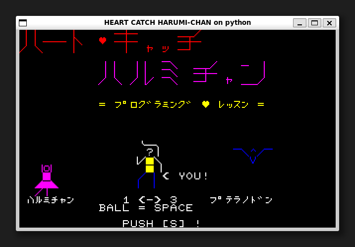

[ [Engligh](README.md) | [日本語](README_ja.md) ]

---

# Heart Catch Harumi-Chan on Python



## Overview

Porting the NEC PC8001 (N-BASIC) game to Python.
It can work in any environment where the TKInter library runs.

## Requirements

* Python 3.5 Leter.  
* Pillow 7.0 Leter.  

The installation of Pillow compatible with the Python version is done below:  
```
$ python -m pip install --upgrade pip
$ python -m pip install --upgrade Pillow
```

> See below for Pillow installation.  
> <https://pillow.readthedocs.io/en/latest/installation.html>

## Running the game

For the first time only, clone the git repository.
```
$ git clone https://github.com/aburi6800/Python-HeartCatchHarumiChan.git
```

Execute the following command.
```
$ cd Python-HeartCatchHarumiChan
$ python HeartCatchHarumiChan.py
```

> For Linux, use the `python3` command instead of the `python` command,  
> or install the `python-is-python3` package.  
> ```
> $ sudo apt install python-is-python3
> ```

## How to play


- Please exterminate the Pteranodon that appears near Harumi's house.  
- Throw the ball and successfully hit the pteranodon's head.  
- Throwing the ball will result in 10 minus points.  
- When the pteranodon touches the power lines, the power goes out and the program Harumi was making on her computer disappears. (Miss.)  
- The game is over if the player misses three times or scores zero points.  
- When the 16 pteranodons are eliminated, there is a happy ending.  

## Controls

|key|Description|
| --- | --- |
|left cursor key|Move left|
|right cursor key|Move right|
|space key|Throw ball|
|s key|Game start|

## Authors
Hitoshi Iwai(aburi6800)

## Thanks
Yoshinao Mori, author of the original game.

## License
MIT License
