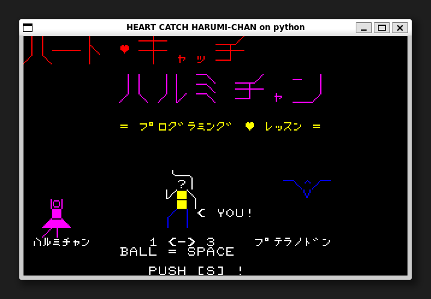
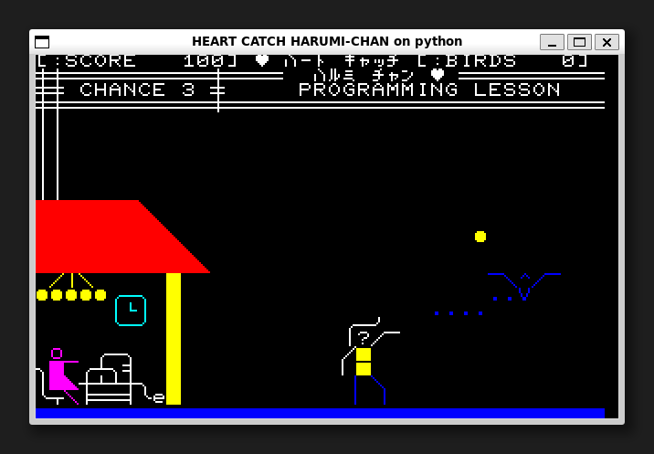

[ [Engligh](README.md) | [日本語](README_ja.md) ]

---

# Heart Catch Harumi-Chan on Python



## 概要

NEC PC8001(N-BASIC)のゲームをPythonへの移植しました。
TKInterライブラリが動作する環境であれば、どのような環境でも動作可能です。

## 要件

* Python 3.5 以降  
* Pillow 7.0 以降  

Pythonのバージョンに対応したPillowのインストールは、以下のように行います：  
```
$ python -m pip install --upgrade pip
$ python -m pip install --upgrade Pillow
```

> Pillowのインストールについては下記を参照ください。  
> <https://pillow.readthedocs.io/en/latest/installation.html>

## ゲームの実行

初回のみ、gitリポジトリのクローンを作成します。  
```
$ git clone https://github.com/aburi6800/Python-HeartCatchHarumiChan.git
```

次のコマンドを実行します。  
```
$ cd Python-HeartCatchHarumiChan
$ python HeartCatchHarumiChan.py
```

> Linuxの場合は、pythonコマンドの代わりにpython3コマンドを使用します。  
> または python-is-python3 パッケージをインストールしてください。  
> ```
> $ sudo apt install python-is-python3
> ```

## How to play



- はるみちゃんの家の近くに出現したプテラノドンを退治してください。  
- ボールを投げて、プテラノドンの頭にうまく当てましょう。  
- ボールを投げると10点マイナスになります。  
- プテラノドンが電線に触れると停電になり、はるみちゃんがパソコンで作っていたプログラムも消えてしまいます。(ミス)  
- 3回ミスするか、得点が0点になるとゲームオーバーとなります。  
- 16匹のプテラノドンを退治すると、ハッピーエンドです。 

## 操作豊富雄

|key|Description|
| --- | --- |
|左カーソルキー|左に移動|
|右カーソルキー|右に移動|
|スペースキー|ボールを投げる|
|sキー|ゲームスタート|

## 作者
Hitoshi Iwai(aburi6800)

## Thanks
Yoshinao Mori, author of the original game.

## ライセンス
MIT License
